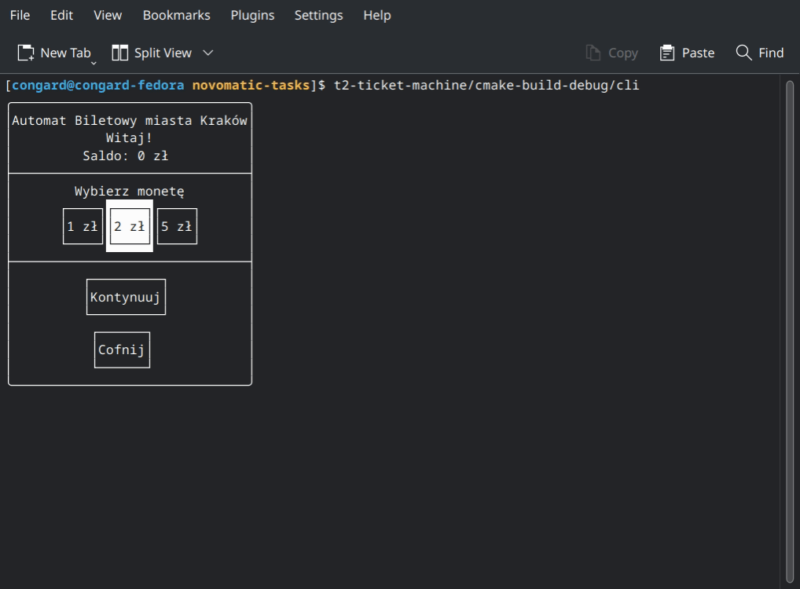

# Automat biletowy



## Opis

Krótki opis poszczególnych klas:

- Klasy współpracujące z urządzeniami (`hardware`)
  - `CoinAcceptor` - akceptor monet, ale również może zwracać monety, np. wydając resztę
  - `TicketPrinter` - drukarka biletów
- Providery (`provider`)
  - `TicketProvider` - udostępnia listę biletów oraz możliwość ich zakupu
- Modele danych (`model`)
  - `CoinDesc` - opis monety, tzn. wartość oraz liczba
  - `CoinValue` - alias; `uint32_t`
  - `Ticket` - bilet
  - `IssuedTicket` - kupiony bilet, zawiera m.in. unikalny identyfikator oraz czas zakupu

> [!IMPORTANT]
> W celu poprawnego wyświetlania UI, należy uruchomić aplikację w terminalu,
> lub w **emulatorze terminala** IDE
> _(CLion: Edit configuration -> Emulate terminal in the output console)_.

## Algorytm

W skrócie: automat ma pewną skończoną liczbę monet (żeby ułatwić testowanie, przyjęto,
że początkowa liczba monet w automacie wynosi 0, tzn. automat nie będzie w stanie zwrócić
resztę, jeżeli nikt wcześniej w nim nic nie kupił).

Sam algorytm korzysta z tzw. heurystyki zachłannej (greedy heuristic), a mianowicie w celu
minimalizacji liczby zwróconych jako reszta monet, zaczyna zwracać monety od monet o największej
wartości.

## Struktura

| Katalog    | Opis                                                                 |
|------------|----------------------------------------------------------------------|
| `include`  | Pliki nagłówkowe biblioteki "automat biletowy" :)                    |
| `tests`    | Testy                                                                |
| `src`      | Kod źródłowy                                                         |
| `src/cli`  | Command-Line Interface: interfejs użytkownika                        |
| `src/core` | Podstawowe pliki źródłowe: głównie klasy abstrakcyjne oraz algorytmy |
| `src/demo` | "Symulator" automatu biletowego                                      |

## Zależności

Wszystkie zależności są pobierane automatycznie.

- [FTXUI](https://github.com/ArthurSonzogni/FTXUI) – biblioteka do tworzenia UI (CLI) w konsoli
- [tulz](https://github.com/congard/tulz) – moja własna biblioteka przydatnych narzędzi
  (m.in. wzorca Observer oraz ThreadPool, które właśnie zostały wykorzystane)

## Kompilacja & uruchomienie

```bash
mkdir cmake-build
cmake -DCMAKE_C_COMPILER=clang -DCMAKE_CXX_COMPILER=clang++ -DCMAKE_BUILD_TYPE=Debug -B cmake-build -G "Ninja"
cmake --build cmake-build --target cli -- -j 16
cmake-build/cli
```

## Testy

Testy można znaleźć w katalogu `tests`.
Jako framework do testowania został użyty **GTest 1.14.0** (zostanie pobrany automatycznie).

## Dlaczego FTXUI?

Z treści zadania wywnioskowałem, że należy zaimplementować CLI. Jednak równie dobrze można by było
np. skorzystać z biblioteki Qt - to nawet by ułatwiło niektóre rzeczy. Ale dzięki tak zaprojektowanej
architekturze, dodanie wsparcia Qt nie powinno stanowić żadnego problemu :) 