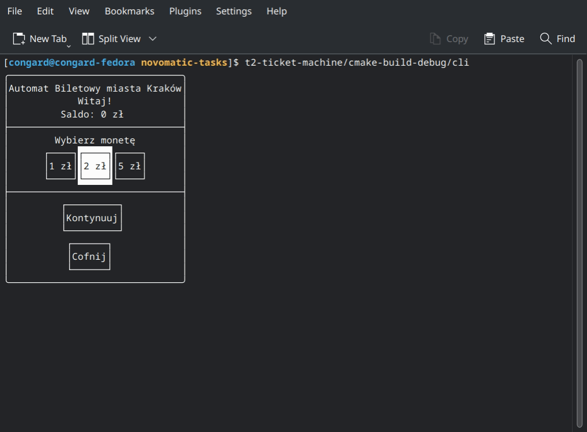

# Task 2: Ticket Machine

[Wersja w języku polskim](README-pl.md)



## Description

Brief description of some core classes:

- Classes that interact with devices (`hardware`):
  - `CoinAcceptor` - a coin acceptor, but it can also give a change
  - `TicketPrinter` - ticket printer
- Providers (`provider`):
  - `TicketProvider` - provides a list of tickets and gives the ability to purchase them
- Data model (`model`):
  - `CoinDesc` - coin description, i.e. value and quantity
  - `CoinValue` - alias; `uint32_t`
  - `Ticket` - ticket
  - `IssuedTicket` - purchased ticket, contains a unique identifier and purchase time

> [!IMPORTANT]
> To display the UI correctly, run the application in a terminal or an **IDE terminal emulator**
> _(CLion: Edit configuration -> Emulate terminal in the output console)_.

## Algorithm

Brief description: the ticket machine has a finite number of coins (for testing convenience, it's assumed
that the initial number of coins in the machine is 0, meaning the machine won't be able to give change
if nobody has made a purchase before).

The algorithm itself uses a greedy heuristic to minimize the number of coins returned as change. It starts
by returning coins with the highest value.

## Structure

| Directory  | Description                                               |
|------------|-----------------------------------------------------------|
| `include`  | Header files for the "ticket machine" library :)          |
| `tests`    | Tests                                                     |
| `src`      | Source code                                               |
| `src/cli`  | Command-Line Interface: user interface                    |
| `src/core` | Core source files: mainly abstract classes and algorithms |
| `src/demo` | "Simulator" of the ticket machine                         |

## Dependencies

All dependencies are automatically downloaded.

- [FTXUI](https://github.com/ArthurSonzogni/FTXUI) – a library for creating UI (CLI) in the console
- [tulz](https://github.com/congard/tulz) – my own library of useful tools
  (including the `Observer` pattern and `ThreadPool`, which were used in this project)

## Compilation & Execution

```bash
mkdir cmake-build
cmake -DCMAKE_C_COMPILER=clang -DCMAKE_CXX_COMPILER=clang++ -DCMAKE_BUILD_TYPE=Debug -B cmake-build -G "Ninja"
cmake --build cmake-build --target cli -- -j 16
cmake-build/cli
```

## Tests

Tests can be found in the `tests` directory.
The **GTest 1.14.0** framework was used for testing (it will be downloaded automatically).

## Why FTXUI?

From the task description, I inferred that a CLI should be implemented. However, one could just as well
use the Qt library, which would make some things easier. But thanks to the designed architecture, adding
Qt support shouldn't be a big deal :)
