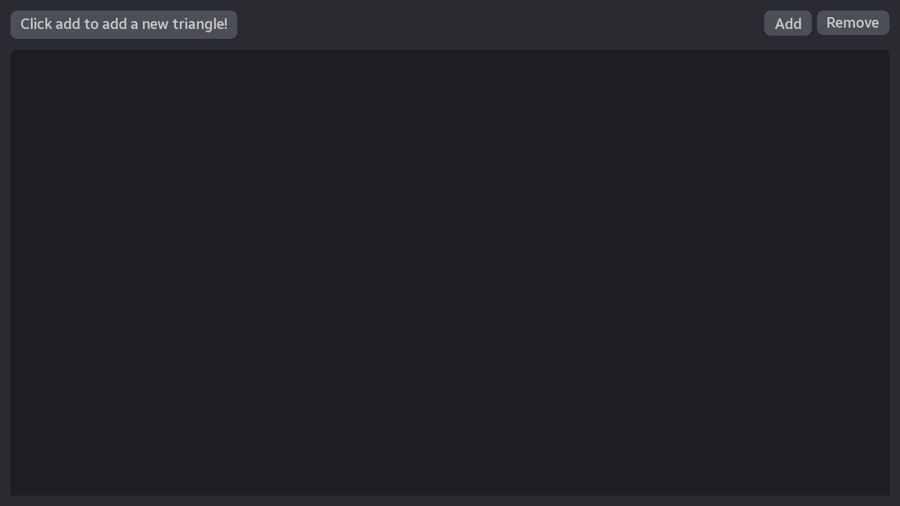

# Task 3: Collision Detection

[Wersja w języku polskim](README-pl.md)



- [Video 1](https://youtu.be/uD7VBqZty5M)
- [Video 2](https://youtu.be/9EaZpsD0348)

## Description

This project is an implementation of task 3. My own engine,
[Algine](https://github.com/congard/algine), was used for the visualizer.

## Algorithm

The algorithm is based on a theorem that states: if you can select an edge from one triangle
such that all vertices of the second triangle lie on one side of that edge, and the third vertex
of the first triangle lies on the opposite side, then these triangles do not intersect.

The implementation of the algorithm can be found in the `src/CollisionDetector` directory.

## Tests

The tests do not require the engine as a dependency and are located in the `tests` directory.
The **GTest 1.14.0** framework was used for testing (it will be downloaded automatically).

## Visualizer Dependencies

System dependencies and tools necessary for compiling the visualizer (using Fedora 39 as an example):

```bash
sudo dnf install mesa-libGL-devel libXrandr-devel \
    libXinerama-devel libXcursor-devel libXi-devel \
    clang clang-devel mold
```

## Compiling the Visualizer

Due to the use of my own engine, the compilation process is somewhat complicated:

1. Clone the engine:
   ```bash
   git clone https://github.com/congard/algine.git
   git checkout ea020af48dbe1e7ab7fe01d46a96affcdd97c56b
   ```

2. To compile the visualizer, execute the following command:
   ```bash
   mkdir cmake-build
   cmake -DCMAKE_C_COMPILER=clang -DCMAKE_CXX_COMPILER=clang++ -DCMAKE_BUILD_TYPE=Debug -B cmake-build -G "Ninja" -DALGINE_PATH="/path/to/algine"
   cmake --build cmake-build --target visualizer -- -j 16
   ```
   This may take a while.

## Running the Visualizer

Before running, set the working directory to `src/visualizer/resources`:

```bash
cd src/visualizer/resources
../../../cmake-build/visualizer
```
